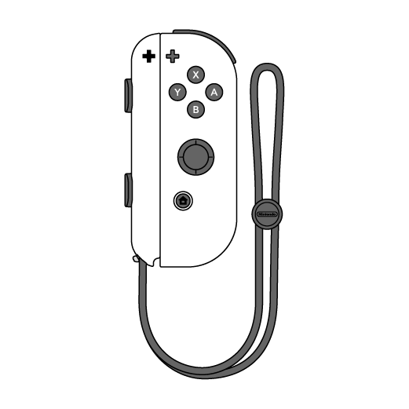

# Joy-Con Control
# 

  
  
  

Joy-Con Control is a programme that let you use your joy-con from the first nintendo switch to control your PC. 

## How to use

- Download Python from [this link](https://www.python.org/downloads/)
- Download this repository using the download button
- Open a terminal in the folder where you downloaded the repository
- Run the command `python -m pip install -r requirements.txt` to install dependencies
- Connect your Joy-Con to the PC
- Run the command `python main.py` to launch the program

## Controls

| Button | Action |
| ------ | ------ |
| `A`        | Right arrow →|
| `B`        | Down arrow ↘|
| `X`        | Up arrow ↗|
| `Y`        | Left arrow ←|
|`R/L`       | Left click.|
| `ZR/ZL`    | Center the mouse.|
| `joystick` | Control mouse.|

``NOTE:`` you can change or add command to button in the [Command.py](https://github.com/Wanous/Joy-Con_Control/blob/main/src/Command.py) file.

## About

The Joy-Con Control programm is recent so it's not complete and bug can occurs. 
Also the project will evolve in the future to provide more correction and feature so give this repository a ⭐ to stay thune !
